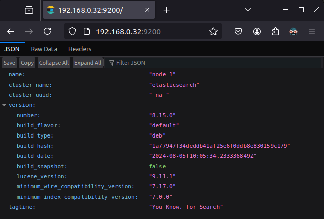
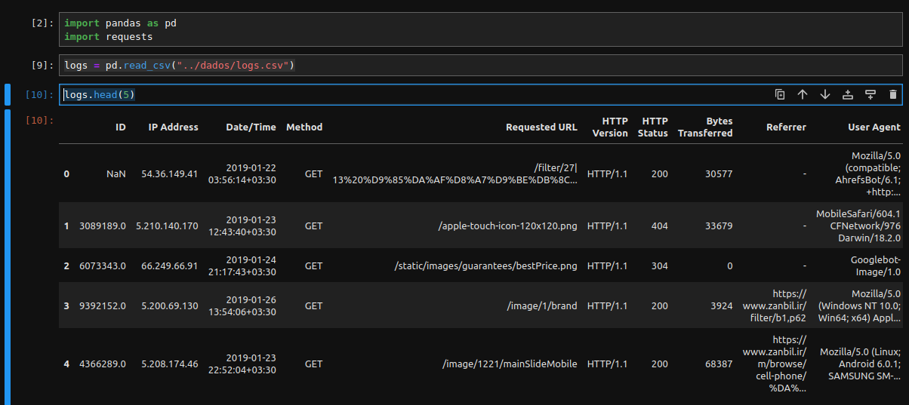
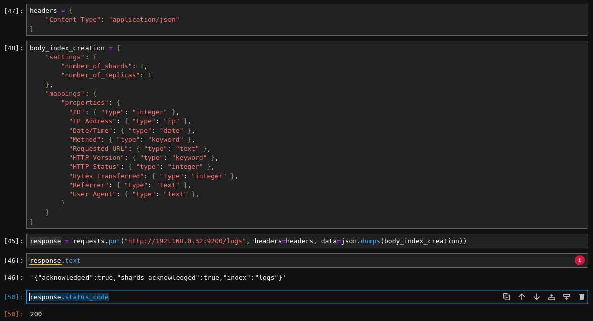
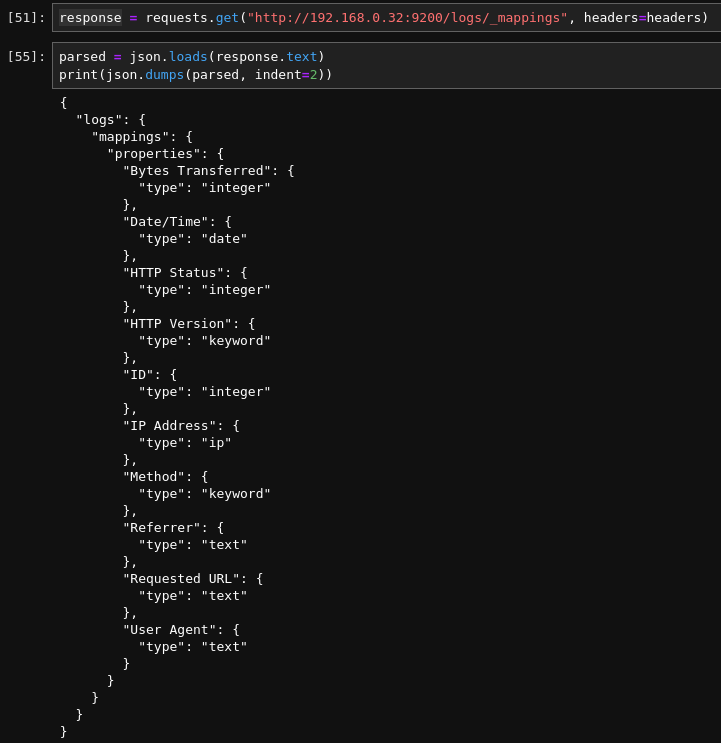

# Laboratório de Criação e Manipulação de Índices e Documentos no Elasticsearch 8

Este laboratório orienta como criar e fazer o mapping de um índice, criar, alterar e deletar documentos desse índice. Começamos escolhendo um conjunto de dados de log no [Kaggle](https://www.kaggle.com/) e fazendo fazendo a leitura, processamento e exportação dos dados no [Jupyter Notebook](https://jupyter.org). O objetivo desse laboratório é aprender mais sobre a API do Elasticsearch e sobre a interação direta com a mesma antes de passarmos para uma ferramenta mais robusta que faça essas chamas sem necessidade de escrita de código.

Este laboratório se baseia fundamentalmente nas seguintes fontes:

- [Documentção Oficial](https://www.elastic.co/docs)
- [Elasticsearch 8 and the Elastic Stack: In Depth and Hands On](https://www.udemy.com/course/elasticsearch-7-and-elastic-stack)

## Pré-requisitos

Antes de começar, precisamos de alguns items:
- O conjunto de dados [webserver-logs-10k](https://www.kaggle.com/datasets/adepvenugopal/webserverlogs10k/data) já convertido em CSV que pode ser encontrado [aqui](./dados/logs.csv).
- O Elasticsearch 8 já devidamente instalado e configurado, o que foi feito no [Lab 1](../Lab%201%20-%20Instala%C3%A7%C3%A3o%20e%20Configura%C3%A7%C3%B5es/README.md)

Caso você deseje fazer a parte de conversão do conjunto de dados para CSV você precisará de:
- Conjunto de dados [webserver-logs-10k.log](https://www.kaggle.com/datasets/adepvenugopal/webserverlogs10k/data) que também pode ser encontrado [aqui](./dados/web-server-access-logs_10k.log)
- Jupyter Notebook, VS Code ou qualquer outro software que permita o uso de arquivos .ipynb. Também é possível usar qualquer arquivos .py ou qualquer outra linguagem, entretanto neste laboratório utilizamos Jupyter Notebook, o notebook pode ser visto [aqui](./jupyter/logs_processing.ipynb).

## Organização e Exportação dos Dados em CSV

Por não se tratar de um laboratório de Jupyter ou Python não iremos nos debruçar a fundo sobre os comandos e sua sintaxe, apenas faremos a descrição do que foi feito para preparar os dados que utilizaremos neste laboratório.

Primeiramente, o conjunto de dados usado neste laboratório foi escolhido justamente por ser um arquivo de logs de um servidor Web, o que se aproxima em algum grau do uso real da pilha [ELK](https://www.elastic.co/elastic-stack/) no contexto de segurança .

Como o Elasticsearch opera através de uma [API](https://en.wikipedia.org/wiki/API) por padrão o corpo das requisições serão transitados como [JSON](https://en.wikipedia.org/wiki/JSON). Como teremos requisições "artesanais", mesmo que usando Python o formato .log acabava sendo confuso por não ser amigável à leitura nem ter conversão fácil para JSON. Por tanto o formato escolhido para armazenar os dados foi CSV, já que assim poderemos ler, armazenarem memória no formato de tabela e por fim exportar linha a linha em JSON usando apenas a biblioteca [Pandas](https://pandas.pydata.org/).

O que fizemos para converter e exportar os dados:
1. Começamos importando as bibliotecas que seriam usadas no processo, elas foram: Pandas, re e datetime.
2. Em seguida lemos o arquivo .log por completo, linha a linha, para dentro de um lista de strings. Cada linha era uma entrada da lista.
3. Criamos um Dataframe, algo similar a uma tabela, contendo uma única coluna, 'Log Line', para armazenar todas as linhas que havíamos lido do arquivo de logs. Nesse ponto os logs ainda estavam em formato de string no seguinte formato:
   
`3089189,"5.210.140.170 - - [23/Jan/2019:12:43:40 +0330] ""GET /apple-touch-icon-120x120.png HTTP/1.1"" 404 33679 ""-"" ""MobileSafari/604.1 CFNetwork/976 Darwin/18.2.0"" ""-"""`

4. Começamos separando essa coluna em duas, "ID" e "Log Entry", para isso pegamos tudo que estava antes da primeira primeira vírgula e chamamos de ID e tudo que estava depois de Log Entry.
5. Em seguida críamos o padrão do regex para extrair os dados do log de cada uma das linhas sem precisar trabalhar campo a campo com split e reconhecimento individual de padrão. Nessa etapa [esse](https://stackoverflow.com/questions/6186938/how-to-use-regexp-on-file-line-by-line-in-python) post do Stack Overflow e o ChatGPT foram primordiais.
6. Em seguida criamos a função "parse_log_entry" que recebe uma entrada de log, como as que salvamos na coluna "Log Entry" alguns passos atrás. Caso fosse possível fazer o match entre a entrada e o regex definido no passo anterior os dados dos campos desse log eram transformados em uma pd.Series com cada dado já na sua devida coluna, esse retorno será já está pronto para ser adicionado ao Dataframe.
7. Após aplicamos a função sobre todo o Dataframe e armazenar os retornos no próprio Dataframe, agora já com as novas colunas "IP Address", "Date/Time", "Method", "Requested URL", "HTTP Version", "HTTP Status", "Bytes Transferred", "Referrer" e "User Agent".
8. Em seguida, removemos a coluna "Log Entry", já que os dados que eram guardados ali agora estão individualmente inseridos no Dataframe.
9. Por fim, salvamos o Dataframe no formato CSV o que facilitará sua leitura para no futuro e evitará retrabalho.

## Verificando Seu Servidor (Linux ou MacOS)

Antes de colocar a mão na massa é preciso verificar se o seu servidor ES8 está rodando e respondendo. Para isso execute o seguinte comando caso esteja no linux `curl -X GET 'http://{IP DO SERVIDOR}:9200'`, a resposta deverá ser algo como: 
```json
{
  "name" : "node-1",
  "cluster_name" : "elasticsearch",
  "cluster_uuid" : "_na_",
  "version" : {
    "number" : "8.15.0",
    "build_flavor" : "default",
    "build_type" : "deb",
    "build_hash" : "1a77947f34deddb41af25e6f0ddb8e830159c179",
    "build_date" : "2024-08-05T10:05:34.233336849Z",
    "build_snapshot" : false,
    "lucene_version" : "9.11.1",
    "minimum_wire_compatibility_version" : "7.17.0",
    "minimum_index_compatibility_version" : "7.0.0"
  },
  "tagline" : "You Know, for Search"
}
```

Caso esteja tudo certo, vamos começar! 

## Verificando Seu Servidor (Windows)

Devido à inabilidade deste autor com Windows eu diria que a forma mais fácil seria simplesmente mudar para Linux, e talvez a segunda mais fácil seja acessar o ip do seu servidor na porta 9200 via browser como pode ser visto a seguir.

<center>
    
</center>

Caso deseje fazer isso via linha de comando você pode encontrar mais informações [aqui](https://superuser.com/questions/344927/powershell-equivalent-of-curl).

## Criando o Seu Primeiro Index

Com tudo devidamente preparado podemos começar. Já que o Elasticsearch atende via API poderíamos utilizar qualquer linguagem para fazer o acesso, na maioria dos tutoriais por aí isso é feito utilizando Shell diretamente via terminal. Porém, utilizaremos Python via Jupyter Notebook, o que nos facilitará muito a vida, entretanto, sinta-se livre para reproduzir em qualquer outra linguagem que desejar.

Vamos aos passos:
1. Já com o Jupyter Notebook aberto, importe as bibliotecas pandas, request e json, será através delas que leremos o CSV gerado alguns passos atrás, converteremos cada log em JSON e faremos as requisições à API.
2. Importe os dados processados anteriormente usando o seguinte comando `logs = pd.read_csv("../dados/logs.csv")`, com isso os logs serão importados para dentro da variável logs no formato de um Dataframe Pandas. Verifique se os dados estão corretos utilizado `logs.head(5)`, repare que o primeiro log não tem ID, portanto evitaremos usa-lo pro enquanto.
<center>
    
</center>

3. Em seguida criaremos o index, para isso precisamos entender dois dos três parâmetros que podemos passar durante a [criação de um index](https://www.elastic.co/guide/en/elasticsearch/reference/current/indices-create-index.html):
    1. Setting: O setting define características do index, como número de shards e número de réplicas, esses dois dados são especialmente importantes porque eles vão ditar a capacidade de resposta e disponibilidade do seu index. Você pode ler mais a respeito na [documentação a respeito do setting](https://www.elastic.co/guide/en/elasticsearch/reference/current/index-modules.html#index-modules-settings).
    2. Mapping:O mapping define como o Elasticsearch irá interpretar os dados que passaremos a armazenar nesse index. Podemos ir desde definir os tipos de cada campo, até definir analysers para processar o campo. Leia mais a respeito na documentação a respeito de: [mapping](https://www.elastic.co/guide/en/elasticsearch/reference/current/mapping.html), [explicit mapping](https://www.elastic.co/guide/en/elasticsearch/reference/current/explicit-mapping.html) e [data types](https://www.elastic.co/guide/en/elasticsearch/reference/current/mapping-types.html).
   
   Com isso feito podemos prosseguir. A próxima coisa que você deve estar atento é a como formar sua requisição de criação do index:

   1. Primeiramente você deve se assegurar de enviar o header `'Content-Type: application/json'` isso é necessário para a maioria das requisições, como estamos trabalhando com python vamos simplesmente criar uma variável para armazenar nosso cabeçalho durante o resto do laboratório, para isso faremos o seguinte:
        ```Python
            headers = {
                "Content-Type": "application/json"
            }
        ```
    2. Também precisamos nos atentar a como criar o corpo da nossa requisição. Como dito antes a rota de criação de index espera três parâmetros opcionais, sendo eles: setting, mapping e alias. Enviaremos dois deles, setting e mapping. A seguir está o corpo que foi criado durante esta prática:
        ```Python
            body_index_creation = {
                "settings": {
                    "number_of_shards": 1,
                    "number_of_replicas": 1
                },
                "mappings": {
                    "properties": {
                    "ID": { "type": "integer" },
                    "IP Address": { "type": "ip" },
                    "Date/Time": { "type": "date" },
                    "Method": { "type": "keyword" },
                    "Requested URL": { "type": "text" },
                    "HTTP Version": { "type": "keyword" },
                    "HTTP Status": { "type": "integer" },
                    "Bytes Transferred": { "type": "integer" },
                    "Referrer": { "type": "text" },
                    "User Agent": { "type": "text" },
                    }
                }
            }
        ```
        Como pode ser visto criaremos o index com um shard e uma réplica, além disso definimos o tipo de cada um dos campos que enviaremos através do mapping.

    Podemos agora juntar tudo em um único comando, `response = requests.put("http://{IP DO SERVIDOR}:9200/logs", headers=headers, data=json.dumps(body_index_creation))`. Com isso criaremos o nosso index, para verificar se obtivemos sucesso olharemos o status da resposta usando `response.text` e/ou `response.status_code`.

    A seguir o resultado no Jupyter Notebook:

    <center>
        
    </center>

    Podemos também verificar o mapping através da rota `{BASE URL}/{index}/_mappings` que retornará um json contendo as informações. Veja:

    <center>
        
    </center>

Com isso você acaba de criar seu primeiro index!

# EM CONSTRUÇÃO !!!
    