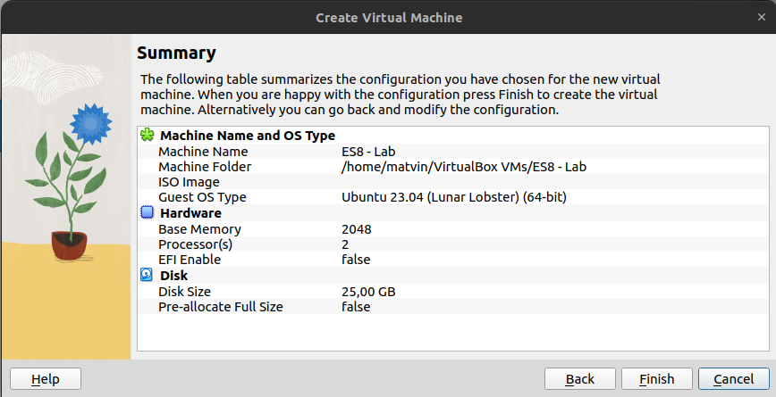
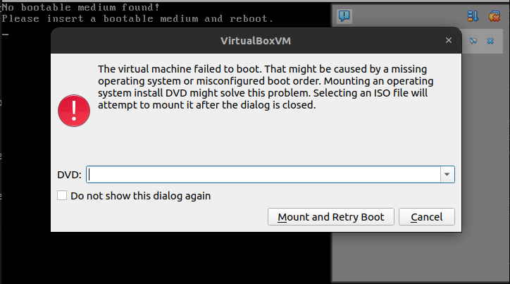
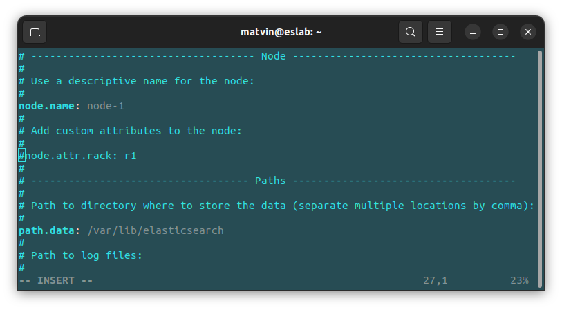
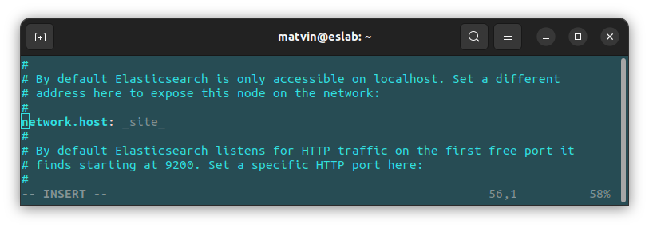
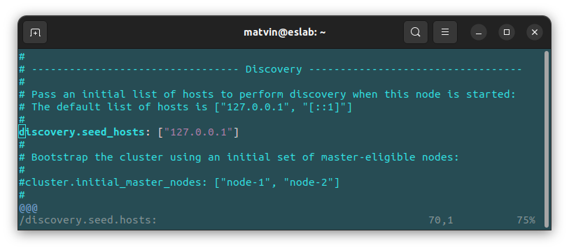
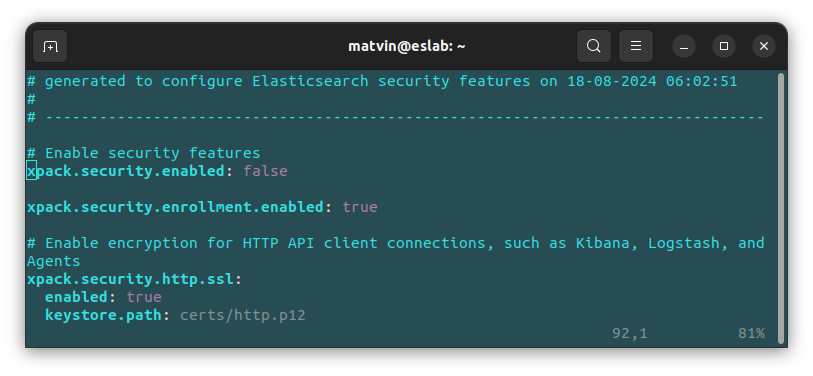
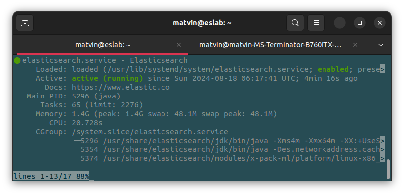
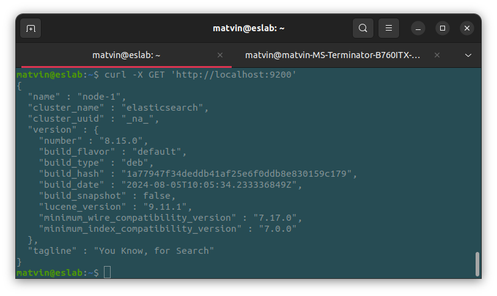

# Laboratório de Instalação do Elasticsearch 8 no Ubuntu Server 24.04

Este laboratório orienta o processo de instalação e configuração do Elasticsearch 8 em uma máquina virtual Ubuntu Server, utilizando o VirtualBox. O objetivo é aprender mais sobre a ferramenta de maneira prática e, no processo, criar um ambiente de busca e análise de dados eficiente e totalmente funcional. Uma instalação via Docker também é possível, mas não será abordada.

Este laboratório se baseia fundamentalmente nas seguintes fontes:

- [Elasticsearch 8 and the Elastic Stack: In Depth and Hands On](https://www.udemy.com/course/elasticsearch-7-and-elastic-stack)
- [How To Install and Configure Elasticsearch on Ubuntu 22.04](https://www.digitalocean.com/community/tutorials/how-to-install-and-configure-elasticsearch-on-ubuntu-22-04)

Entretanto, vários outros sites foram consultados e, em sua maioria, são citados dentro do próprio texto.

## Pré-requisitos

Antes de começar, alguns itens são fundamentais:

- VirtualBox instalado em seu sistema. Para isso, acesse a seção de downloads do site oficial do  [Virtualbox](https://www.virtualbox.org/wiki/Downloads).
- Imagem ISO do Ubuntu Server. Neste laboratório foi usada a versão 24.04, porém as versões 22 e 20 devem funcionar de maneira similar. Você pode obter a imagem no site oficial do  [Ubuntu](https://ubuntu.com/download/server).
- Imagem VDI do Ubuntu Server, que pode ser baixada no [OSBoxes](https://www.osboxes.org/virtualbox-images/). (Opcional)
- Requisitos mínimos de hardware. Neste laboratório, será utilizada uma máquina virtual, que, apesar de não ter interface gráfica, ainda tem requisitos mínimos. Portanto, sua máquina hospedeira deve ter recursos suficientes para suportar tanto o sistema hospedeiro quanto o convidado. É recomendado: 
    - 2 GB de RAM
    - 2 núcleos de processamento
    - 25 GB de armazenamento

## Configuração do Ambiente

Antes de começar, saiba que existe outra forma de obter sua máquina virtual sem instalar o Ubuntu Server manualmente do zero. O item opcional na lista de requisitos se refere a uma máquina virtual já pronta que pode ser importada no VirtualBox. Essa opção poupa bastante tempo e é razoavelmente intuitiva; entretanto, para este laboratório, a máquina virtual foi criada e configurada manualmente.

1. **Criando a Máquina Virtual:**
    - Com o VirtualBox instalado, vá em "Novo".
    - Dê um nome à sua máquina virtual
    - Selecione o diretório onde ela será armazenada (esse passo é importante, pois os possíveis logs de erro estarão aqui).
    - Selecione o tipo como Linux e, por fim, em "Versão", busque a distro específica que deseja instalar ou selecione "Outro", que provavelmente estará no fim da lista de versões. Avance para a próxima etapa.
    

    
    

    
    - Nesta etapa, selecione a memória RAM e o número de núcleos de processamento que sua máquina virtual terá acesso. As recomendações para o Ubuntu Server são de 1 GB de RAM. Um único processador também deve ser suficiente; entretanto, neste laboratório, a máquina tem 2 GB de RAM e 2 núcleos. Avance para a próxima etapa.
    - Selecione a quantidade de memória que sua máquina terá à disposição, utilizaremos 25 GB.
    - Selecione sua máquina virtual recém-criada e inicie-a.
    - O passo anterior resultará em um popup de erro (é possível evitar esse caminho adicionando a imagem ISO à máquina antes de fazer o primeiro boot) com um campo de seleção. Clique no botão de seta para baixo e em "Outro" para navegar até a imagem do Ubuntu Server. Clique na opção de montar e reinicie.
    

    
    

    - A máquina irá reiniciar e você se deparará com o GRUB. Selecione "Try or Install Ubuntu Server".
    - A partir daqui, tudo é intuitivo; é necessário apenas atenção na segunda tela do processo de instalação, onde você deve informar o layout do seu teclado. 
    - Outro ponto de atenção virá algumas telas depois, onde você deve decidir se deseja ou não instalar um servidor SSH. Essa escolha fica ao seu critério, porém é bastante mais fácil fazer login na sua máquina via SSH e copiar e colar comandos no terminal hospedeiro do que configurar o VirtualBox para aceitar transferência entre as máquinas convidada e hospedeira.

2. **Configuração Inicial da VM:**
   - Se você optou por usar SSH para se conectar à sua máquina, faça isso neste passo. Para isso::
        - Vá às configurações da sua máquina, na aba de rede, mude o adaptador para Bridge ou leia [isso](https://www.baeldung.com/linux/virtualbox-ping-guest-machines) e [isso](https://www.virtualbox.org/manual/UserManual.html#natforward) e vá pelo seu próprio caminho
        - No Ubuntu Server, rode `ip addr` e descubra seu IP.
        - Em seguida, vá ao terminal da máquina hospedeira (Linux ou Mac; caso você use Windows, utilize o [Putty](https://www.chiark.greenend.org.uk/~sgtatham/putty/)  ou algo similar) e faça o login com ssh `{NOME DO SEU USUÁRIO}@{IP DA MÁQUINA VIRTUAL}`, digite "yes" para a pergunta que surgirá na sua tela e, em seguida, entre com a senha. Você estará logado.
   - Apesar de você ter recém instalado seu Ubuntu Server, é primordial rodor o comando `sudo apt update && sudo apt upgrade`. Isso garantirá que o sistema esteja devidamente atualizado e ajuda a evitar erros e conflitos, além de manter seu sistema mais seguro.
   - O Elasticsearch roda em cima de uma JVM; logo, o próximo passo é instalar o Java. Neste laboratório, será utilizado o Java 17. Para isso, insira o comando `sudo apt install openjdk-17-jdk -y`.
   - Verifique a instalação com `java -version`.

3. **Instalando o Elasticsearch 8**
    - Como o Elasticsearch tem o próprio repositório, o primeiro passo é baixar e instalar a chave pública deles:
    
     &emsp;&emsp;`curl -fsSL https://artifacts.elastic.co/GPG-KEY-elasticsearch | sudo gpg --dearmor -o /usr/share/keyrings/elastic.gpg`
    
    - Adicione o repositório do Elasticsearch à sua lista de fontes APT:

     &emsp;&emsp;`echo "deb [signed-by=/usr/share/keyrings/elastic.gpg] https://artifacts.elastic.co/packages/7.x/apt stable main" | sudo tee -a /etc/apt/sources.list.d/elastic-7.x.list`

    - Faça o update do sistema mais uma vez:
    
    &emsp;&emsp;`sudo apt update`

    - Instale o Elasticsearch:

    &emsp;&emsp;`sudo apt install elasticsearch`

4. **Configurando o Elasticsearch**
    
    - Acesse o arquivo de configuração com o seu editor favorito (I use VIM BTW 😂), esse arquivo se encontra em `/etc/elasticsearch/elasticsearch.yml`. Segue o exemplo com o VIM:

    &emsp;&emsp;`sudo vim /etc/elasticsearch/elasticsearch.yml`

    - Primeiramente, vamos definir o nome do nosso servidor. Busque por node.name no VIM (isso pode ser feito utilizando `/`). Esse nome deve ser amigável para humanos, já que facilmente identifica seu servidor. O Elasticsearch irá, por padrão, utilizar o nome da máquina onde ele está instalado. No entanto, para customizar, altere a linha em questão para algo parecido com isso:

    

    
    

    - A seguir, altere a linha que contém network.host. Esse campo determina a quais interfaces de rede o Elasticsearch irá servir. Por padrão, o Elasticsearch vem configurado para responder apenas requisições do localhost. Entretanto, para este laboratório, queremos que ele responda a todos os IPs locais (o que inclui nossa máquina hospedeira). Em produção, essa escolha deve ser avaliada com mais cuidado. [Este é um artigo interessante para usar de referência](https://opster.com/guides/elasticsearch/glossary/elasticsearch-network-host-configuration/).
   
    

    
    

    - O próximo passo é definir a lista de servidores de descoberta. Em caso de formação de um cluster, os nós contidos nessa lista servirão para informar quem é o nó mestre e quem são os outros nós, basicamente esses são os pontos de contato para o nosso nó se situar no cluster. No caso deste laboratório, como teremos um único nó, também haverá apenas o endereço de loopback na lista. Vá à linha que contém `discovery.seed_hosts` e altere-a da seguinte forma:
    
    

    
    

    - O último passo vem acompanhado de um **ALERTA**: essa configuração não é válida para produção e **NÃO** deve ser repetida fora de um ambiente de desenvolvimento ou teste. Iremos alterar as configurações de segurança, desativando-as. A segurança do Elasticsearch realiza controle de acesso, criptografia da comunicação, logs de auditoria e gerenciamento de usuários. Em uma futura versão, este laboratório será atualizado para habilitar essa opção. Segue a alteração na linha contendo `xpack.security.enabled`:

    

    
    

    - Salve o arquivo e saia do editor.

    - Inicie o serviço com `sudo systemctl start elasticsearch`

    - Verifique o estado do serviço com `sudo systemctl status elasticsearch`

    

    
    

    - Habilite o serviço para iniciar junto com a inicialização do sistema. Para isso, rodee `sudo systemctl enable elasticsearch`

    - Para testar o servidor execute o comando `curl -X GET 'http://localhost:9200'` ou `curl -X GET 'http://{IP DA VM}:9200'` ,caso você tenha seguido o passo a passo à risca e deseje usar o sistema hospedeiro para testar seu servidor Elasticsearch.

    

    
    

## Conclusão
**Parabéns! Você concluiu a instalação e configuração do Elasticsearch 8. Para mais informações e documentação, visite [a documentação oficial do Elasticsearch](https://www.elastic.co/guide/en/elasticsearch/reference/current/index.html).** 
    
    
    

